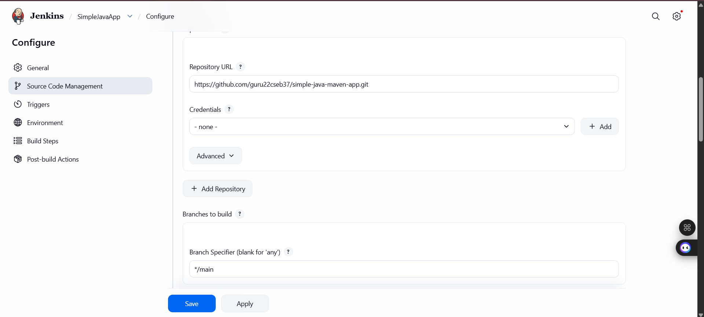
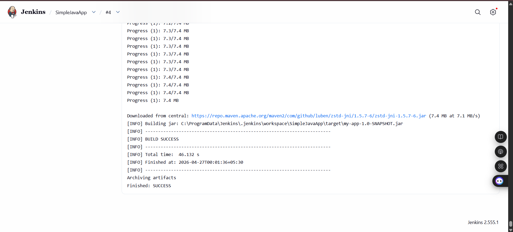

# 🚀 End-to-End Java CI/CD Pipeline

[](https://jenkins.io/)
[](https://github.com/)
[](https://maven.apache.org/)
[](https://www.oracle.com/java/)

> A professional-grade demonstration of a fully automated CI/CD pipeline using **Jenkins**, **GitHub**, and **Maven**. This project automates the entire lifecycle of a Java application—from code commit to build, test, and artifact archiving.

---

## 🌟 Overview

This repository hosts a robust Java application integrated into a state-of-the-art DevOps ecosystem. Every push to this repository triggers an automated build process that ensures code quality and rapid delivery.

### Key Features
- 🏗️ **Automated Build**: Seamless compilation using Apache Maven.
- 🧪 **Continuous Testing**: Automated execution of JUnit test cases.
- 📦 **Artifact Management**: Automatic archiving of build artifacts (JAR files) in Jenkins.
- 🔗 **GitHub Integration**: Connected via Git SCM for real-time code synchronization.

---

## 🛠️ Tech Stack

- **Source Control**: GitHub
- **CI/CD Engine**: Jenkins (Running as a Windows Service)
- **Build Tool**: Apache Maven
- **Language**: Java 17+
- **Testing**: JUnit

---

## 🏗️ Pipeline Architecture

1.  **Code Commit**: Developer pushes code to the `main` branch on GitHub.
2.  **Jenkins Trigger**: Jenkins detects changes (via Webhooks/Polling).
3.  **Clone**: Jenkins pulls the latest code to its workspace.
4.  **Maven Build**: Runs `mvn clean package` to compile and test the app.
5.  **Artifact Archiving**: The resulting `.jar` file is safely stored for deployment.

---

## 📸 Project Showcase

### Jenkins Job Configuration


### Successful Build Output


---

## 🚀 Getting Started

### Prerequisites
- JDK 17 or higher
- Jenkins 2.x+
- Apache Maven

### Installation
1. Clone the repository:
   ```bash
   git clone https://github.com/guru22cseb37/simple-java-maven-app.git
   ```
2. Build locally:
   ```bash
   mvn clean package
   ```

---

## 👤 Author

**Guru**  
*Computer Science & Engineering Student*  
[GitHub Profile](https://github.com/guru22cseb37)

---

✨ *This project was developed as part of a DevOps Engineering curriculum.*
